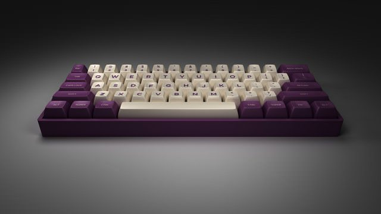
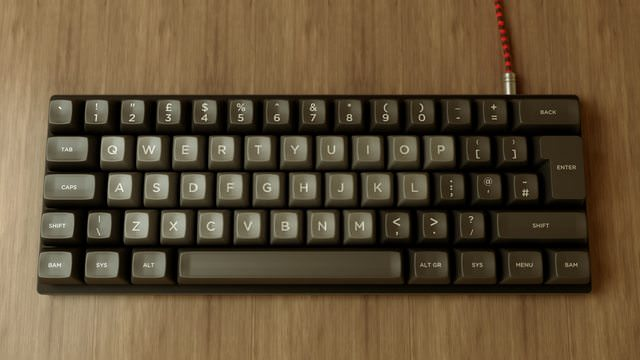
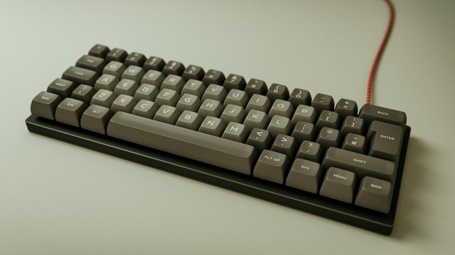

# Keyboard-Layout-Editor-for-Blender
Allows you to import keyboard layouts into blender and render them in 3d

### Examples:

Courtesy of [/u/jacopods](https://reddit.com/u/jacopods)

&nbsp;

Courtesy of [/u/zzubnik](https://reddit.com/u/zzubnik)

&nbsp;

Courtesy of [/u/zzubnik](https://reddit.com/u/zzubnik)

*Please open a pull request if you'd like to add more examples*

### How to install Addon:
1. Download the zip ([releases](https://github.com/kirpal/keyboard-layout-editor-for-blender/releases))
2. Open Blender
3. Go to *File > User Preferences* (`Ctrl + Alt + U`)
4. Select the "Add-ons" tab.
5. Click `Install from File...` at the bottom of the panel
6. Select the zip archive that you downloaded and click `Install from File…` at the top right
7. Check the checkbox next to `Import-Export: Import: KLE Raw JSON format (.json)`
8. Click `Save User Settings` and close the preferences window
9. Now the addon is ready to use

### How to use Addon:
1. Open Blender
2. Go to *File > Import > KLE Raw Data (.json)*
3. Select the “keyboard-layout.json” that you downloaded from [Keyboard Layout Editor](http://keyboard-layout-editor.com) and click `Import KLE Raw JSON` at the top right
4. All Done!

### How to add LEDs:
+ Add the following line to the object at the beginning (the one with "backcolor" in it):

    `"led" : [RED, GREEN, BLUE, BRIGHTNESS]` *(you may need to add a comma to the line above)*
    + RED, GREEN, and BLUE are out of 255, and BRIGHTNESS is from 0 to 1

+ To make the keycap legends backlit, make the legend color the same as whatever color you made the LEDs

### Blender scene file
A basic scene for blender can be found in [this gist](https://gist.github.com/wilderjds/5e43cc04f202fe71c51f69e4775a3c4e).  Open the scene in blender before importing.  Please note that lighting, camera and render setup will most probably require some tweaking to fit with your specific layout.

### Contributions

Special thanks to [@zslane](https://deskthority.net/zslane-u8694/) on Deskthority for the SA models.
Thanks to [@wilderjds](https://github.com/wilderjds) for implementing SA support

#### To-Do

- [x] Add support for ISO enter
- [x] Add key labels
- [x] Add more key profiles (DSA, SA and DCS are done)
- [x] Add support for fonts (Google Fonts only)
- [ ] Add support for glyphs
- [x] Add legend alignment
- [ ] Add front legend support