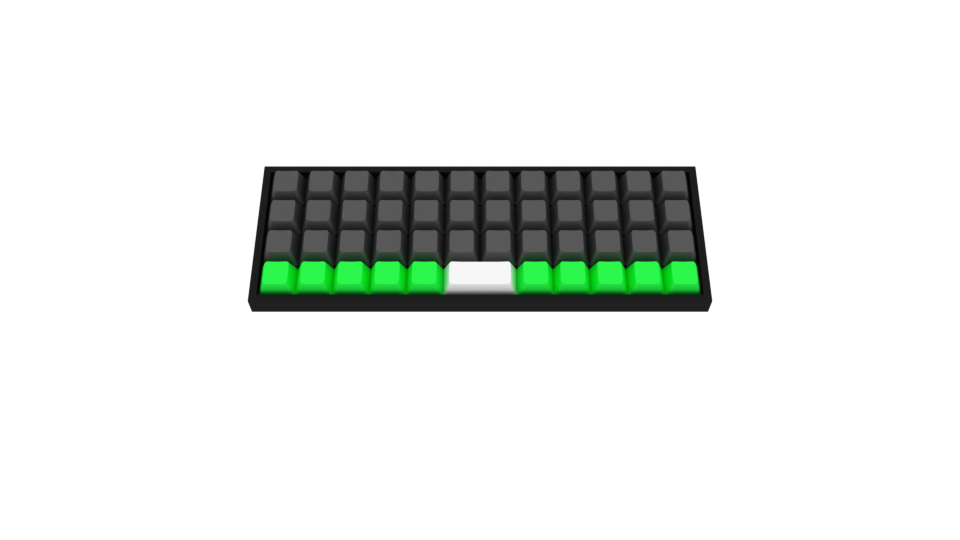

# Keyboard-Layout-Editor-for-Blender
Allows you to import keyboard layouts into blender and have them render in 3d
####To-Do
- [x] Add support for ISO enter
- [ ] Add key labels
- [ ] Add more key profiles (DSA and DCS are done)

##How to install Addon:
1. Download zip
2. Open Blender
3. Go to File>User Preferences (Ctrl + Alt + U)
4. Click “Install from File...” at the bottom of the panel
5. Select the zip archive that you downloaded and click “Install from File…” at the top right
6. Check the checkbox next to “Import-Export: Import: KLE Raw JSON format (.json)”
7. Click “Save User Settings” and close the preferences window
8. Now the addon is ready to use

##How to use Addon:
1. Open Blender
2. Go to File>Import>KLE Raw Data (.json)
3. Select the “keyboard-layout.json” that you downloaded from [Keyboard Layout Editor](http://keyboard-layout-editor.com) and click “Import KLE Raw JSON” at the top right
4. All Done!

##Examples:

